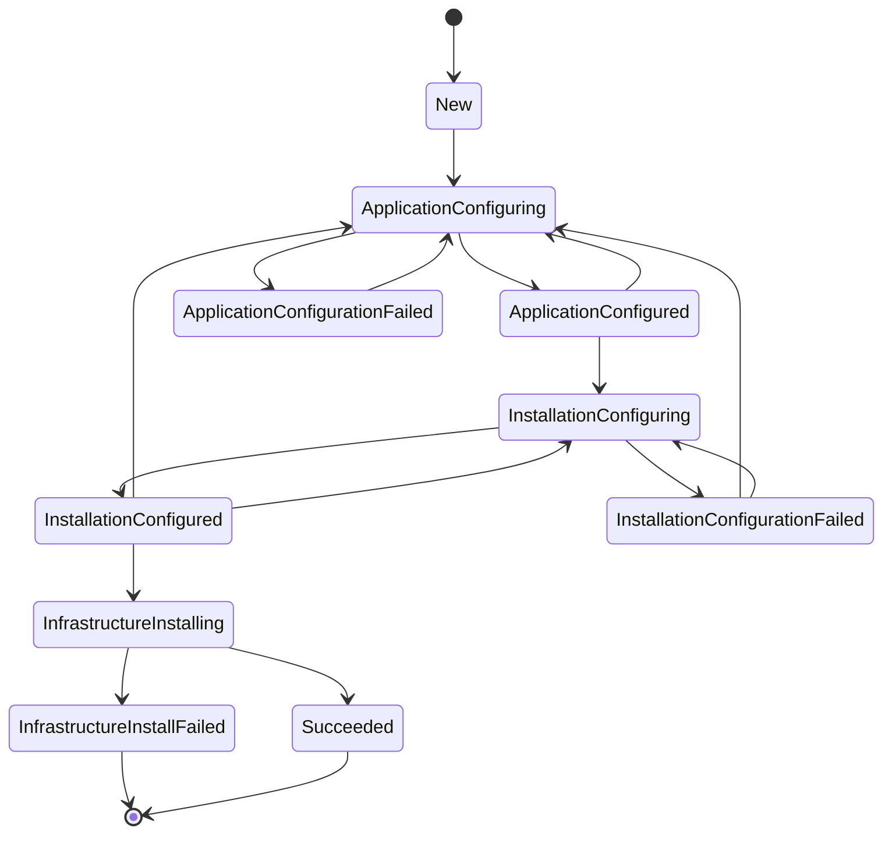

# Kubernetes Installation State Machine

## State Transition Diagram

## State Descriptions

- **New**: Initial state of the install process
- **ApplicationConfiguring**: Application is being configured
- **ApplicationConfigured**: Application is configured
- **ApplicationConfigurationFailed**: Application failed to be configured
- **InstallationConfiguring**: Installation is being configured
- **InstallationConfigured**: Installation is configured
- **InstallationConfigurationFailed**: Installation failed to be configured
- **InfrastructureInstalling**: Infrastructure is being installed
- **InfrastructureInstallFailed**: Infrastructure failed to install (final state)
- **Succeeded**: Installation has succeeded (final state)

## Key Observations

1. **Final States**: Only `InfrastructureInstallFailed` and `Succeeded` are final states (no outgoing transitions)
2. **Recovery Paths**: Most failure states allow recovery by transitioning back to earlier states
3. **Configuration States**: The system has separate configuring/configured states for Application and Installation phases
4. **Simplified Flow**: This state machine is simpler than the Linux version, lacking Host configuration and Preflight phases
5. **Bidirectional Flow**: Most states can transition back to earlier configuration states for retry scenarios

## Comparison with Linux State Machine

The Kubernetes installation state machine is a simplified version of the Linux state machine:

- **Missing Phases**: No Host configuration or Preflight phases
- **Streamlined Process**: Direct progre
sion from Installation configuration to Infrastructure installation
- **Fewer States**: 10 states vs 16 states in the Linux version
- **Similar Recovery**: Maintains the same recovery patterns for configuration failures 
