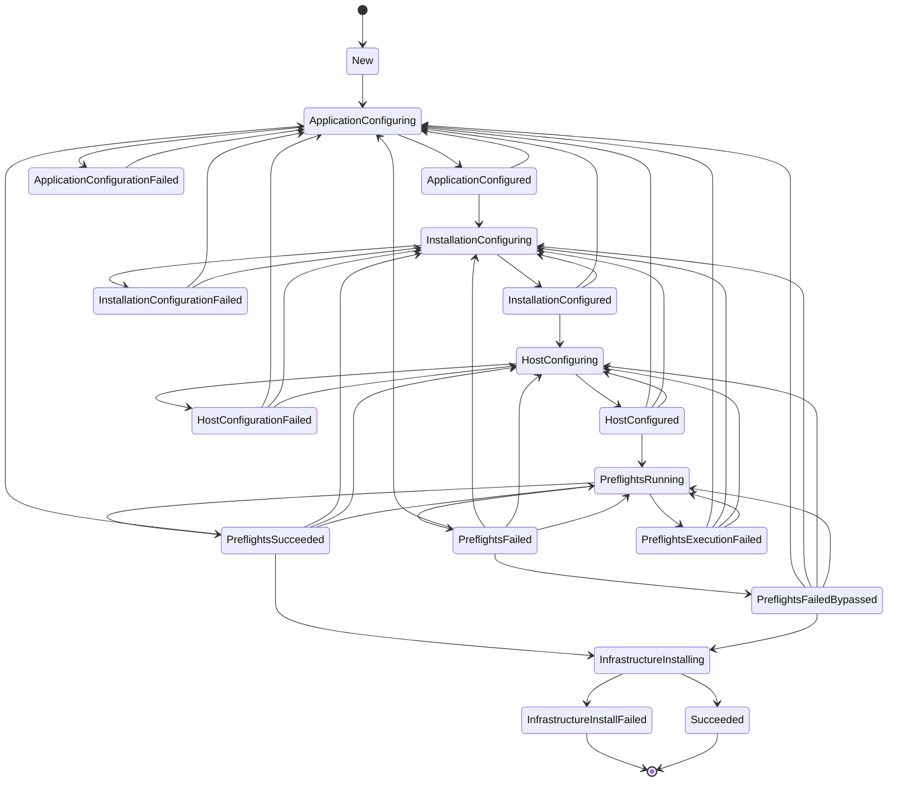

# Embedded Cluster Installation State Machine

## State Transition Diagram

## State Descriptions

- **New**: Initial state of the install process
- **ApplicationConfiguring**: Application is being configured
- **ApplicationConfigured**: Application is configured
- **ApplicationConfigurationFailed**: Application failed to be configured
- **InstallationConfiguring**: Installation is being configured
- **InstallationConfigured**: Installation is configured
- **InstallationConfigurationFailed**: Installation failed to be configured
- **HostConfiguring**: Host is being configured
- **HostConfigured**: Host is configured
- **HostConfigurationFailed**: Host failed to be configured
- **PreflightsRunning**: Preflights are running
- **PreflightsExecutionFailed**: Preflights failed to execute due to system error
- **PreflightsSucceeded**: Preflights have succeeded
- **PreflightsFailed**: Preflights detected issues on the host
- **PreflightsFailedBypassed**: User bypassed failed preflights
- **InfrastructureInstalling**: Infrastructure is being installed
- **InfrastructureInstallFailed**: Infrastructure failed to install (final state)
- **Succeeded**: Installation has succeeded (final state)

## Key Observations

1. **Final States**: Only `InfrastructureInstallFailed` and `Succeeded` are final states (no outgoing transitions)
2. **Recovery Paths**: Most failure states allow recovery by transitioning back to earlier states
3. **Configuration States**: The system has separate configuring/configured states for Application, Installation, and Host phases
4. **Preflight Flexibility**: The system allows retrying preflights and bypassing failures
5. **Bidirectional Flow**: Most states can transition back to earlier configuration states for retry scenarios 
