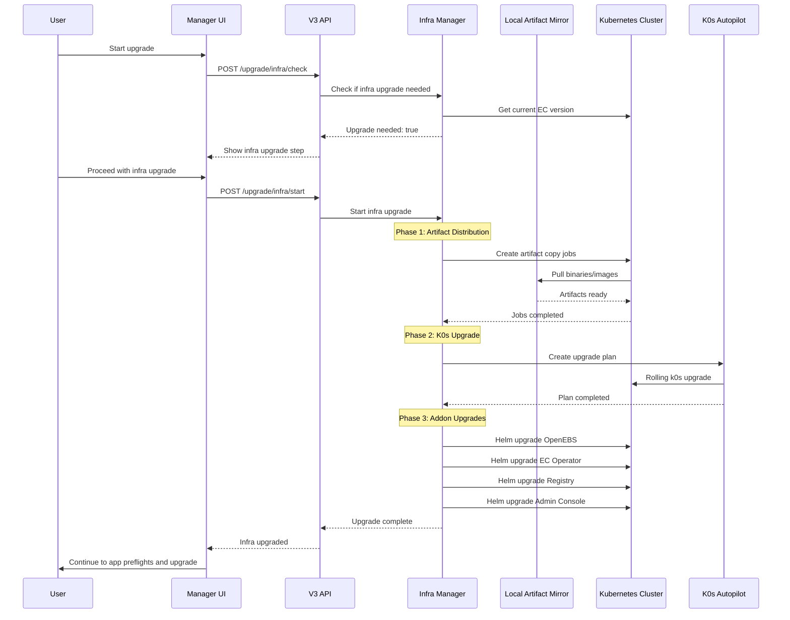

# V3 Infra Upgrade

## TL;DR

We're moving infrastructure upgrades from the current operator-based architecture to the v3 CLI/API architecture. This applies to all installation modes: **single-node, multi-node, online, and airgap**. The implementation maintains the same underlying infrastructure upgrade behavior (artifact distribution, k0s autopilot rolling upgrades, helm-based addon upgrades) while moving orchestration from an in-cluster operator job to the out-of-cluster v3 API. The new approach integrates infrastructure upgrades into the existing v3 upgrade flow, executing them before application upgrades via a new Infra Upgrade Manager. This provides a more robust upgrade experience through the manager UI with better visibility and error handling across all deployment topologies. The implementation follows v3 patterns with a controller/manager/store architecture and state machine orchestration, delivering infrastructure upgrades as a seamless step in the upgrade wizard rather than requiring separate operator-based job creation.

## The problem

The current operator-based infrastructure upgrade approach has several limitations:

1. **In-cluster fragility**: Creating upgrade jobs inside the cluster being upgraded is inherently brittle - if the upgrade partially fails, the operator itself may be unable to recover or report status
2. **Poor visibility**: Users have limited visibility into upgrade progress, relying on kubectl commands to check job status rather than a guided UI experience
3. **Inconsistent architecture**: Having two separate upgrade mechanisms (operator for infrastructure, v3 for apps) creates maintenance burden and user confusion
4. **Limited error handling**: Recovery from failed upgrades requires manual intervention with kubectl and understanding of internal job structures

Moving to the v3 architecture addresses these issues by performing upgrades from outside the cluster with better progress tracking, error handling, and user experience.

## Scope

This proposal covers **all installation modes**:
- Single-node online
- Single-node airgap
- Multi-node online
- Multi-node airgap

The key architectural change is consistent across all modes: **move orchestration from in-cluster (operator job) to out-of-cluster (v3 API)**. The underlying upgrade mechanisms (k0s autopilot for rolling upgrades, artifact distribution jobs, helm-based addon upgrades) remain the same.

### Implementation Strategy

While the upgrade architecture can support all modes from day one, the **implementation will be incremental**:

1. **Initial milestone**: Single-node online (lowest risk, highest user base)
2. **Follow-up work**: Airgap support (reuse v2 airgap patterns)
3. **Follow-up work**: Multi-node support (reuse v2 multi-node coordination patterns)

This approach allows us to:
- Validate the out-of-cluster orchestration architecture early
- Get user feedback from the most common use case
- Minimize risk by tackling one dimension at a time
- Reuse proven v2 logic for airgap and multi-node

The architecture is designed to make these follow-up milestones straightforward ports of existing v2 functionality, not architectural rework.

### Future Improvements

Once the v3 architecture is stable across all installation modes, we can evolve it with improvements such as:
- **Direct artifact distribution from v3 API**: Have k0s autopilot pull artifacts directly from the v3 API instead of local artifact mirror/replicated.app
- This allows the v3 API to have full control over artifact distribution and caching

## Architecture Overview

```
┌─────────────────────────────────────────────────────────────┐
│                    Manager UI (React)                       │
│  ┌──────────┬──────────┬──────────┬──────────────┬────────┐│
│  │ Welcome  │  Config  │  Infra   │ App Preflight│  App   ││
│  │  Step    │   Step   │ Upgrade  │    Step      │Upgrade ││
│  └──────────┴──────────┴──────────┴──────────────┴────────┘│
└───────────────────────┬─────────────────────────────────────┘
                        │ HTTPS/JWT Auth
┌───────────────────────▼─────────────────────────────────────┐
│                        API Layer                            │
│  ┌────────────────────────────────────────────────────┐     │
│  │              Upgrade Routes                        │     │
│  │  /linux/upgrade/infra/*                            │     │
│  │  /linux/upgrade/app/*                              │     │
│  └────────────────────────────────────────────────────┘     │
└───────────────────────┬─────────────────────────────────────┘
                        │
┌───────────────────────▼─────────────────────────────────────┐
│                  Controller Layer                           │
│  ┌──────────────────────────────────────────────────────┐   │
│  │        Linux Upgrade Controller (Extended)          │   │
│  │  ┌─────────────────────────────────────────────────┐│   │
│  │  │          Infra Upgrade Manager                 ││   │
│  │  │  - K0s Autopilot orchestration                 ││   │
│  │  │  - Addon Helm upgrades                         ││   │
│  │  │  - Artifact distribution                       ││   │
│  │  │  - Progress tracking                           ││   │
│  │  └─────────────────────────────────────────────────┘│   │
│  │  ┌─────────────────────────────────────────────────┐│   │
│  │  │         App Upgrade Manager (Existing)         ││   │
│  │  └─────────────────────────────────────────────────┘│   │
│  └──────────────────────────────────────────────────────┘   │
└──────────────────────────────────────────────────────────────┘
                        │
┌───────────────────────▼─────────────────────────────────────┐
│              Infrastructure Components                      │
│  ┌──────────────────────────────────────────────────────┐   │
│  │  Local Artifact Mirror (existing, port 50000)       │   │
│  │  K0s Autopilot API                                  │   │
│  │  Helm Client                                        │   │
│  │  Kubernetes Client                                  │   │
│  └──────────────────────────────────────────────────────┘   │
└──────────────────────────────────────────────────────────────┘
```

## Upgrade Flow Sequences

### Single-Node Online Upgrade



## Implementation Differences by Mode

### Online vs Airgap

Both modes use the same artifact distribution logic, with the only difference being the source of the artifacts.

**Online mode:**

Artifacts are pulled from replicated.app.

**Airgap mode:**

Artifacts are pulled from the EC airgap registry.

### Single-Node vs Multi-Node

K0s autopilot handles multi-node coordination automatically through rolling upgrades:

Autopilot automatically:
- Upgrades controllers one at a time (maintaining quorum)
- Waits for each controller to be healthy before proceeding
- Upgrades workers in a rolling fashion
- Handles node draining and pod rescheduling

The infra manager simply creates the plan and monitors progress - autopilot handles the complex coordination.

## New Subagents / Commands

**No new subagents or commands will be created.** The implementation reuses existing patterns and integrates into the current v3 upgrade command.

## Database

**No database changes required.**

The infrastructure upgrade uses the same in-memory state storage pattern as the existing v3 upgrade workflow.

## Implementation plan

### Phase 1: Infra Upgrade Manager Core

**Files to create:**
```
api/internal/managers/infra/
├── manager.go          # Interface definition
├── upgrade.go          # Core upgrade logic
├── artifacts.go        # Artifact distribution
├── autopilot.go        # K0s autopilot integration
├── clusterconfig.go    # Cluster config update
├── addons.go           # Addon upgrade orchestration
├── extensions.go       # Extensions upgrade
└── progress.go         # Progress tracking
```

**Pseudo code:**
```go
// api/internal/managers/infra/manager.go
type InfraUpgradeManager interface {
    // Check if infra upgrade is needed
    NeedsUpgrade(ctx context.Context) (bool, error)

    // Start infra upgrade process
    StartUpgrade(ctx context.Context) error

    // Get current upgrade status
    GetStatus(ctx context.Context) (types.InfraUpgrade, error)
}

// api/internal/managers/infra/upgrade.go
type infraUpgradeManager struct {
    kubeClient        kubernetes.Interface
    helmClient        helm.Interface
    runtimeConfig     runtimeconfig.RuntimeConfig
    releaseData       *release.ReleaseData
    localArtifactPort int
    store            store.Store
    logger           logrus.FieldLogger
}


func (m *infraUpgradeManager) StartUpgrade(ctx context.Context) error {
    // 1. Set status to "Distributing artifacts"
    // 2. Create artifact distribution jobs to pull binaries from replicated.app
    // 3. Wait for artifact jobs to complete
    // 4. Set status to "Upgrading Kubernetes"
    // 5. Create k0s autopilot plan
    // 6. Monitor autopilot plan progress
    // 7. Update cluster config with new images and unsupported overrides
    // 8. Set status to "Upgrading addons"
    // 9. Upgrade addons in order (OpenEBS, EC Operator, Registry, Admin Console)
    // 10. Set status to "Upgrading extensions"
    // 11. Upgrade extensions
    // 12. Create host support bundle (best effort)
    // 13. Set status to "Complete"
}
```

### Phase 2: Controller Integration

**Files to modify:**
```
api/controllers/linux/upgrade/controller.go  # Add infrastructure manager
api/controllers/app/controller.go           # Add infra check method
```

**Pseudo code:**
```go
// api/controllers/linux/upgrade/controller.go
type LinuxUpgradeController struct {
    *app.AppController
    infraManager infra.InfraUpgradeManager  // NEW
    store        store.Store
}

func (c *LinuxUpgradeController) CheckInfraUpgrade(ctx context.Context) (types.InfraCheck, error) {
    needed, err := c.infraManager.NeedsUpgrade(ctx)
    if err != nil {
        return types.InfraCheck{}, err
    }

    return types.InfraCheck{
        UpgradeNeeded: needed,
        CurrentVersion: getCurrentECVersion(),
        TargetVersion: c.releaseData.ECVersion,
    }, nil
}

func (c *LinuxUpgradeController) StartInfraUpgrade(ctx context.Context) error {
    lock, err := c.stateMachine.AcquireLock()
    if err != nil {
        return types.NewConflictError(err)
    }
    defer lock.Release()

    // Transition to infrastructure upgrading state
    err = c.stateMachine.Transition(lock, states.StateInfrastructureUpgrading)
    if err != nil {
        return fmt.Errorf("transition states: %w", err)
    }

    // Start upgrade in background
    go func() {
        err := c.infraManager.StartUpgrade(context.Background())
        if err != nil {
            c.logger.Errorf("Infra upgrade failed: %v", err)
            // Transition to failed state
            c.stateMachine.Transition(lock, states.StateInfrastructureUpgradeFailed)
        } else {
            // Transition to success state
            c.stateMachine.Transition(lock, states.StateInfrastructureUpgradeSucceeded)
        }
    }()

    return nil
}
```

### Phase 3: API Endpoints

**Files to modify:**
```
api/routes.go                               # Add infra routes
api/internal/handlers/linux/upgrade.go     # Add infra handlers
api/types/upgrade.go                       # Add infra types
```

**New endpoints:**
```
POST /api/linux/upgrade/infra/check    # Check if upgrade needed
POST /api/linux/upgrade/infra/start    # Start infra upgrade
GET  /api/linux/upgrade/infra/status   # Get upgrade status
```

### Phase 4: State Machine Integration

**Files to modify:**
```
api/internal/states/upgrade/states.go      # Add infrastructure states
```

**New states:**
```go
const (
    // Existing states...
    StateInfrastructureChecking    State = "InfrastructureChecking"
    StateInfrastructureUpgrading   State = "InfrastructureUpgrading"
    StateInfrastructureUpgradeSucceeded State = "InfrastructureUpgradeSucceeded"
    StateInfrastructureUpgradeFailed    State = "InfrastructureUpgradeFailed"
)
```

**State transitions:**
```
StateApplicationConfigured
    ↓
StateInfrastructureChecking → (skip if not needed)
    ↓
StateInfrastructureUpgrading → StateInfrastructureUpgradeSucceeded/Failed
    ↓
StateAppPreflightsRunning → StateAppPreflightsSucceeded/Failed
    ↓
StateAppUpgrading → StateSucceeded/Failed
```

### Phase 5: Frontend Integration

**Files to modify:**
```
web/src/components/wizard/InstallWizard.tsx           # Add infra step
web/src/components/wizard/infra/                      # New component directory
  ├── InfraUpgradeStep.tsx
  └── InfraUpgradeStep.test.tsx
```

**Pseudo code:**
```typescript
// InfraUpgradeStep.tsx
const InfraUpgradeStep: React.FC = () => {
    const [status, setStatus] = useState<InfraStatus>();
    const [checking, setChecking] = useState(true);

    useEffect(() => {
        // Check if infra upgrade needed
        fetch('/api/linux/upgrade/infra/check')
            .then(res => res.json())
            .then(data => {
                if (!data.upgradeNeeded) {
                    // Skip to next step
                    onNext();
                } else {
                    setChecking(false);
                }
            });
    }, []);

    const startUpgrade = async () => {
        await fetch('/api/linux/upgrade/infra/start', {
            method: 'POST'
        });
        // Start polling for status
        pollStatus();
    };

    return (
        <div>
            {checking ? (
                <p>Checking infra version...</p>
            ) : (
                <>
                    <h2>Infra Upgrade Required</h2>
                    <p>Current: {status?.currentVersion}</p>
                    <p>Target: {status?.targetVersion}</p>
                    <button onClick={startUpgrade}>Start Upgrade</button>
                    {status?.progress && <ProgressBar value={status.progress} />}
                </>
            )}
        </div>
    );
};
```

### Phase 6: Artifact Distribution

**Reuse existing patterns from operator:**
- Create Kubernetes Jobs for each node to pull artifacts
- Jobs mount host filesystem at `/embedded-cluster`
- **Online mode**: Pull binaries from replicated.app
- **Airgap mode**: Pull binaries, images, and charts from EC airgap registry
- Jobs use local-artifact-mirror container image
- Monitor job completion via Kubernetes API
- Wait for LAM to restart after detecting EC binary update

**Key difference:** Jobs are created and monitored from outside the cluster via the Infra Manager, not by the operator.

### Phase 7: K0s Autopilot Integration

**Reuse existing autopilot patterns:**
- Create autopilot Plan CR with target k0s version
- Plan references local artifact mirror URL for binaries
- Monitor plan status via Kubernetes API
- Clean up completed plans

**Implementation in Infra Manager:**
```go
func (m *infraUpgradeManager) upgradeK0s(ctx context.Context) error {
    // Create autopilot plan
    plan := &autopilotv1beta2.Plan{
        ObjectMeta: metav1.ObjectMeta{
            Name: "ec-upgrade-" + time.Now().Format("20060102-150405"),
        },
        Spec: autopilotv1beta2.PlanSpec{
            Commands: []autopilotv1beta2.PlanCommand{
                {
                    K0sUpdate: &autopilotv1beta2.PlanCommandK0sUpdate{
                        Version: m.releaseData.K0sVersion,
                        Platforms: autopilotv1beta2.PlanPlatformResourceMap{
                            "linux-amd64": {
                                URL: fmt.Sprintf("http://127.0.0.1:%d/bin/k0s", m.localArtifactPort),
                            },
                        },
                        Targets: autopilotv1beta2.PlanCommandTargets{
                            Controllers: []string{"*"},
                            Workers:     []string{"*"},
                        },
                    },
                },
            },
        },
    }

    // Create plan in cluster
    _, err := m.kubeClient.AutopilotV1beta2().Plans().Create(ctx, plan, metav1.CreateOptions{})
    if err != nil {
        return fmt.Errorf("create autopilot plan: %w", err)
    }

    // Monitor plan progress
    return m.waitForAutopilotPlan(ctx, plan.Name)
}
```

### Phase 8: Cluster Config Update

**After k0s upgrade, update cluster config:**
- Update cluster config with new images (pause image, etc.)
- Apply vendor unsupported k0s config overrides
- Apply end-user k0s config overrides
- Use k0s 1.29 compat conversion for updates

**Why after k0s upgrade:** The cluster config schema may have changed between k0s versions, so we must update after k0s is upgraded.

**Implementation:**
```go
func (m *infraUpgradeManager) updateClusterConfig(ctx context.Context) error {
    // Get current cluster config
    // Render new config with updated images
    // Apply unsupported overrides from Installation CR
    // Update cluster config if changes detected
}
```

### Phase 9: Addon Upgrades

**Reuse existing addon upgrade patterns:**
- Sequential Helm upgrades of system addons
- Order: OpenEBS → EC Operator → Registry → Admin Console
- Each addon generates values from Installation CR
- Use atomic Helm upgrades with rollback on failure

**Implementation:**
```go
func (m *infraUpgradeManager) upgradeAddons(ctx context.Context) error {
    addons := []string{"openebs", "embedded-cluster-operator", "registry", "admin-console"}

    for _, addon := range addons {
        m.store.SetStatus(types.Status{
            State: types.StateRunning,
            Description: fmt.Sprintf("Upgrading %s", addon),
        })

        if err := m.upgradeAddon(ctx, addon); err != nil {
            return fmt.Errorf("upgrade %s: %w", addon, err)
        }
    }

    return nil
}
```

### Phase 10: Extensions Upgrade

**Upgrade vendor extensions:**
- Get previous installation to compare extension versions
- Use extensions package to upgrade each extension
- Extensions are Helm charts defined by the vendor

**Implementation:**
```go
func (m *infraUpgradeManager) upgradeExtensions(ctx context.Context) error {
    // Get previous installation
    // Call extensions.Upgrade() with previous and current installation
}
```

### Phase 11: Post-Upgrade Tasks

**Final cleanup and verification:**
- Create host support bundle for troubleshooting
- Update Installation CR state to "Installed"
- Clean up any temporary resources

**Implementation:**
```go
func (m *infraUpgradeManager) postUpgrade(ctx context.Context) error {
    // Create host support bundle (best effort, log errors)
    // Set installation state to installed
}
```

## Testing

### Unit Tests
```
api/internal/managers/infra/upgrade_test.go
- Test version comparison logic
- Test artifact job creation
- Test autopilot plan creation
- Test addon upgrade sequencing
- Test error handling and rollback

api/controllers/linux/upgrade/controller_test.go
- Test infra check endpoint
- Test state transitions
- Test concurrent upgrade prevention
```

### Integration Tests
```
api/integration/linux/upgrade/infra_test.go
- Test full infra upgrade flow
- Test skip when versions match
- Test failure recovery
- Test progress reporting
```

## Backward compatibility

### API Versioning
- New `/upgrade/infra/*` endpoints are additive
- Existing operator-based upgrade remains functional
- No changes to Installation CR structure

### Data Format Compatibility
- Artifact directory structure unchanged
- Autopilot plan format unchanged
- Helm values generation unchanged

### Migration Windows
- Gradual migration: operator-based upgrades continue to work
- `ENABLE_V3=1` feature flag to enable v3 infra upgrades
- Eventually deprecate operator upgrade job creation

## Migrations

**Deployment is straightforward** as this is an additive change:

1. Deploy new API with infra manager
2. Deploy updated UI with infra step
3. Enable via `ENABLE_V3=1` feature flag
4. Gradually roll out to users
5. Eventually remove operator upgrade code

The existing operator-based upgrade continues to work during the migration period.

## Trade-offs

**Optimizing for:** Reliability, visibility, and user experience

1. **Out-of-cluster orchestration over in-cluster jobs**
   - Pro: More reliable, better error recovery
   - Con: Requires maintaining cluster connection during upgrade

2. **Synchronous upgrade flow over background processing**
   - Pro: Clear progress tracking, immediate feedback
   - Con: UI blocked during long-running upgrades

3. **Reuse operator patterns over complete rewrite**
   - Pro: Proven logic, faster implementation
   - Con: Some complexity in adapting in-cluster patterns to out-of-cluster execution

4. **Sequential addon upgrades over parallel**
   - Pro: Predictable, easier to debug failures
   - Con: Slower total upgrade time

## Alternative solutions considered

1. **Keep operator-based upgrades, add UI wrapper**
   - Rejected: Doesn't address fundamental reliability issues

2. **Direct port of operator code to CLI**
   - Rejected: Would duplicate significant code, miss opportunity to improve architecture

3. **Skip infra upgrades in v3**
   - Rejected: Users need complete upgrade solution

4. **Parallel addon upgrades**
   - Rejected: Dependencies between addons make this complex and risky

5. **New upgrade agent/daemon**
   - Rejected: Adds complexity without clear benefits over API-based approach

## Research

### Prior art in our codebase

**Reference**: `proposals/research/infrastructure_upgrade_architecture_20251006.md`

Key findings from research:
- Operator creates upgrade jobs that run in-cluster
- Artifact distribution uses per-node jobs
- K0s autopilot provides rolling upgrade capability
- Addon upgrades follow strict sequencing
- Local artifact mirror serves binaries/images on port 50000

### External references

- K0s Autopilot documentation: https://docs.k0sproject.io/stable/autopilot/
- Helm upgrade documentation: https://helm.sh/docs/helm/helm_upgrade/
- Kubernetes Job patterns: https://kubernetes.io/docs/concepts/workloads/controllers/job/

### Spikes conducted

- Tested creating autopilot plans via client-go - works as expected
- Verified artifact jobs can be monitored externally - status available via API
- Confirmed Helm client can upgrade from outside cluster - no issues

## Checkpoints (PR plan)

### PR 1: Infra Manager Core
**Deliverable**: Basic infra upgrade manager with version checking
- Infra manager interface and structure
- Version comparison logic
- State storage
- Unit tests

### PR 2: Artifact Distribution
**Deliverable**: Artifact distribution via Kubernetes jobs
- Job creation and monitoring
- Progress tracking
- Integration with local artifact mirror
- Tests for job orchestration

### PR 3: K0s Autopilot Integration
**Deliverable**: K0s upgrade via autopilot
- Autopilot plan creation
- Plan monitoring and status updates
- Error handling and cleanup
- Tests for autopilot flow

### PR 4: Addon Upgrades
**Deliverable**: Sequential addon upgrades via Helm
- Addon upgrade orchestration
- Values generation from Installation CR
- Progress reporting per addon
- Tests for addon upgrades

### PR 5: Controller and API Integration
**Deliverable**: API endpoints and controller wiring
- Infra check endpoint
- Upgrade start/status endpoints
- State machine integration
- Controller methods
- Integration tests

### PR 6: Frontend Integration
**Deliverable**: UI for infra upgrades
- Infra upgrade step component
- Progress visualization
- Auto-skip when not needed
- Frontend tests

Each PR provides incremental value and can be tested independently.